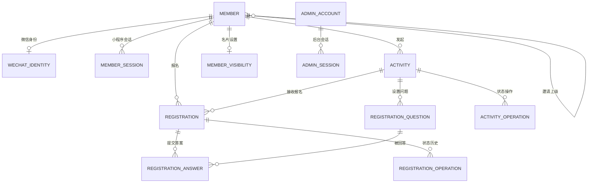

# 数据关系｜首个业务流程

状态：2026-09-26。MySQL + Drizzle 首批 13 张表已定义；迁移 `0000`、`0001` 按 2026-09-25 工程记录已在隔离 MySQL 8.4.11 与主机开发库 8.0.36 执行验证。2026-09-26 已重新核对主机开发库 8.0.36，执行身份大小写修正迁移 `0002` 并通过真实数据库验证；该修正在 8.4.11 上尚未验证。表定义位于 `apps/api/src/database/schema`，迁移位于 `apps/api/drizzle`；会话、权限、活动和报名业务服务尚未实现。产品行为以[首期 PRD](../product/首期PRD.md) F01–F04 为准。

## 1. 关系总览

平台根节点是 `member.kind = platform_root` 的单独记录，仅作邀请树根，不出现在普通会员名单或报名中。普通会员首次建立微信身份时写入 `inviter_member_id`，之后不可由普通流程更新。`wechat_identity` 的唯一键为 `(app_id, openid)`；`member.invite_code` 唯一。`unionid` 可为空，不作为本次身份唯一键。

## 2. 最小表及关键约束

| 表 | 最小字段与关系 | 必须落地的约束 |
| --- | --- | --- |
| `member` | `id`、`kind`、会员编号、邀请码、`inviter_member_id`、头像、名称、绑定手机号、其他资料、创建时间 | UUID 主键；邀请码及会员编号唯一；普通会员的邀请上级引用会员或平台根；邀请关系建立后不可覆盖 |
| `wechat_identity` | `member_id`、`app_id`、`openid`、可空 `unionid` | `(app_id, openid)` 唯一；同一微信身份不得创建两个会员 |
| `member_visibility` | `member_id`、七个可选名片字段的独立布尔开关 | `member_id` 唯一；七项默认关闭；头像与名称没有关闭开关 |
| `member_session` / `admin_session` | 主体 ID、令牌摘要、到期、撤销、创建时间 | 令牌摘要唯一；过期或撤销后不可认证 |
| `admin_account` | `id`、授权状态及后台凭据引用 | 独立于会员身份；凭据形式待后台登录方案确认 |
| `activity` | `id`、`organizer_member_id`、标题、介绍、时间、地点、`fee_type`、`fee_amount_cents`、`consultation_contact`、可空容量与截止、生命周期、下架状态、历史报名标记、当前有效占位数、取消时报名人数快照 | 免费时金额为空，收费时金额非空且为正整数；咨询联系方式非空；首个报名后金额锁定；时间顺序有效；容量为正；当前占位数不能为负或超容量；发布后发起人固定 |
| `registration_question` | `id`、`activity_id`、题型、题干、必填、排序、单选/多选选项 | 题型与选项匹配；活动出现首个报名后题目与选项锁定 |
| `registration` | `id`、`activity_id`、`member_id`、状态、当次联系手机号、报名/取消时间、到场标记 | `(activity_id, member_id)` 唯一；头像、名称不复制到报名；本次联系手机号独立于会员绑定手机号 |
| `registration_answer` | `registration_id`、`question_id`、答案 | `(registration_id, question_id)` 唯一；服务端校验题目属于同一活动及必填、选项规则 |
| `registration_operation` | 报名 ID、动作、操作人、操作时间 | 首次报名、本人取消、再次报名分别留痕；不得以新增第二条报名主记录代替再次报名 |
| `activity_operation` | 活动 ID、操作人类型与 ID、动作、原因或变更摘要、操作时间 | 下架、恢复、发起人取消及咨询联系方式修改均留痕；需填写原因的动作由服务端校验非空 |

`activity` 的生命周期与下架状态及其允许的变化见[流程状态设计](first-flow.md)。`fee_amount_cents` 只表达活动公开标价，不代表应收或实收；报名、付款和退款之间没有平台状态关联，schema 不设置付款说明、收款码、付款状态或退款状态。咨询联系方式属于活动信息，不复用会员绑定手机号或报名联系手机号。浏览、统计、AI、评论和通知表在对应切片设计。状态变更所需的站内通知持久化结构会随该动作一并实现；这里暂不展开通知内容与阅读状态。

## 3. 事务与并发

首次登录以 `(app_id, openid)` 唯一约束兜底：事务内查询或创建会员、身份映射及邀请关系；并发唯一键冲突后读取已有会员，不重写邀请上级。

报名、取消或再次报名统一先锁定 `activity` 行，再读取和锁定该会员的 `registration` 行；在同一事务中检查状态、服务端当前时间、容量与资料门槛，写报名、答案与操作历史，并更新 `activity.active_registration_count`。报名使用条件更新或行锁串行化最后一个名额；重复提交由 `(activity_id, member_id)` 唯一键和状态判定保证幂等，不可凭前端按钮状态控制名额。取消成功后同一事务释放一个占位；重试取消不得重复减数。再次报名把原主记录从 `cancelled` 恢复为 `active` 并重新占位，不新增第二行，也不保留名额优先权。发起人取消或管理员下架时也先锁活动行，保证与同时报名的顺序确定。

问题或收费金额编辑同样先锁定 `activity` 行，再检查 `has_registration_ever`，避免与首笔报名竞态。第一笔报名写入后，该标记永久为真；即使报名者随后取消，题目、选项和收费金额仍锁定。活动正常且未到报名截止时，当前有效报名者可修改答案；活动取消后永久禁止修改，活动下架期间暂时禁止，恢复后按原截止时间重新判断。咨询联系方式可在活动结束前修改，写活动操作记录并向当前有效报名者创建站内通知。

发起人取消活动时，在同一活动行锁和事务内把当时的 `active_registration_count` 复制到 `cancellation_registration_count`，再写取消状态、原因和操作记录。取消页面及历史统计读取这个不可变快照；`active_registration_count` 继续只表示当前未主动取消的报名人数，后续即使发生数据修正也不能改变取消时人数。

咨询联系方式的读取权以“该会员是否存在本活动报名主记录”为准，不以当前是否为 `active` 为准。因此本人取消、活动取消或下架后，曾成功报名者仍可读取最新联系方式；从未报名者不得取得。

所有业务时间按 UTC 写入，API 使用 ISO 8601，界面按中国时区展示。`createDatabase` 将驱动时区设为 `Z`，并在每次连接借出前完成 `SET SESSION time_zone = '+00:00'`；初始化失败时销毁连接并拒绝借出。仅设置驱动时区不能改变 MySQL 的 `CURRENT_TIMESTAMP` 语义。事务比较使用服务端可信时间，不接受客户端提交的当前时间。外键、唯一键、索引和事务 SQL 在生成 migration 后审查，并用真实 MySQL 验证最后名额竞争、重复报名、取消释放与首次邀请绑定。

微信身份的 `app_id`、`open_id`、`union_id` 使用 `utf8mb4_0900_bin` 逐值精确比较，不能继承数据库的大小写不敏感排序规则。该修正通过新增迁移 `0002` 应用，不重写已执行迁移；2026-09-26 已在本地主机 MySQL 8.0.36 验证大小写不同值可分别保存和精确查询，完全重复身份仍被唯一键拒绝。新连接、复用连接、事务连接的 UTC 设置以及日期往返和默认时间均已验证，测试数据全部回滚。时区修复不会回填已有时间值，历史时间是否需要修正须先核验原连接时区和实际数据。
