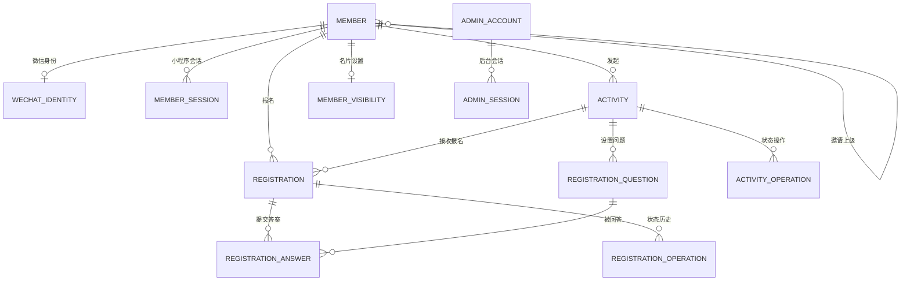

# 数据关系｜首个业务流程

状态：2026-09-26。MySQL + Drizzle 首批表已定义；迁移 `0000`、`0001` 按 2026-09-25 工程记录已在隔离 MySQL 8.4.11 与主机开发库 8.0.36 执行验证。2026-09-26 先前任务已执行身份大小写修正迁移 `0002`；该修正在 8.4.11 上尚未验证。表定义位于 `apps/api/src/database/schema`，迁移位于 `apps/api/drizzle`。本次沿用现有结构实现会话、资料、活动浏览与报名；已通过真实 MySQL 8.0.36 单事务回滚验证，未执行新迁移。2026-09-26 17:36按用户授权直接使用本机开发库进行真实多连接并发测试，首次身份竞争、邀请固定、最后名额、重复报名、并发取消和再报通过；仅清理本次UUID/appId，前后9表数量一致。未建立独立测试库，微信上游仍为测试替身。产品行为以[首期 PRD](../product/首期PRD.md) F01–F04 为准。

## 1. 关系总览

```mermaid
erDiagram
  MEMBER ||--o| WECHAT_IDENTITY : "微信身份"
  MEMBER ||--o{ MEMBER : "邀请上级"
  MEMBER ||--o{ MEMBER_SESSION : "小程序会话"
  MEMBER ||--o{ ACTIVITY : "发起"
  MEMBER ||--o{ REGISTRATION : "报名"
  ACTIVITY ||--o{ REGISTRATION : "接收报名"
  ACTIVITY ||--o{ REGISTRATION_QUESTION : "设置问题"
  REGISTRATION ||--o{ REGISTRATION_ANSWER : "提交答案"
  REGISTRATION ||--o{ REGISTRATION_OPERATION : "状态历史"
  REGISTRATION_QUESTION ||--o{ REGISTRATION_ANSWER : "被回答"
  MEMBER ||--o| MEMBER_VISIBILITY : "名片设置"
  ADMIN_ACCOUNT ||--o{ ADMIN_SESSION : "后台会话"
  ACTIVITY ||--o{ ACTIVITY_OPERATION : "状态操作"
```

平台根节点是 `member.kind = platform_root` 的单独记录，仅作邀请树根，不出现在普通会员名单或报名中。普通会员首次建立微信身份时写入 `inviter_member_id`，之后不可由普通流程更新。`wechat_identity` 的唯一键为 `(app_id, openid)`；`member.invite_code` 唯一。`unionid` 可为空，不作为本次身份唯一键。

## 2. 最小表及关键约束

| 表 | 最小字段与关系 | 必须落地的约束 |
| --- | --- | --- |
| `member` | `id`、`kind`、会员编号、邀请码、`inviter_member_id`、头像、名称、绑定手机号、其他资料、创建时间 | UUID 主键；邀请码及会员编号唯一；普通会员的邀请上级引用会员或平台根；邀请关系建立后不可覆盖 |
| `wechat_identity` | `member_id`、`app_id`、`openid`、可空 `unionid` | `(app_id, openid)` 唯一；同一微信身份不得创建两个会员 |
| `member_visibility` | `member_id`、七个可选名片字段的独立布尔开关 | `member_id` 唯一；七项默认关闭；头像与名称没有关闭开关 |
| `member_session` / `admin_session` | 主体 ID、令牌摘要、到期、撤销、创建时间 | 令牌摘要唯一；过期或撤销后不可认证 |
| `admin_account` | `id`、显示名称、授权状态 | 独立于会员身份；一对一凭据保存于 `admin_credentials`，账号密码方式已确认 |
| `activity` | `id`、`organizer_member_id`、标题、介绍、时间、地点、`fee_type`、`fee_amount_cents`、`consultation_contact`、可空容量与截止、生命周期、下架状态、历史报名标记、当前有效占位数、取消时报名人数快照 | 免费时金额为空，收费时金额非空且为正整数；咨询联系方式非空；首个报名后金额锁定；时间顺序有效；容量为正；当前占位数不能为负或超容量；发布后发起人固定 |
| `registration_question` | `id`、`activity_id`、题型、题干、必填、排序、单选/多选选项 | 题型与选项匹配；活动出现首个报名后题目与选项锁定 |
| `registration` | `id`、`activity_id`、`member_id`、状态、当次联系手机号、报名/取消时间、到场标记 | `(activity_id, member_id)` 唯一；头像、名称不复制到报名；本次联系手机号独立于会员绑定手机号 |
| `registration_answer` | `registration_id`、`question_id`、答案 | `(registration_id, question_id)` 唯一；服务端校验题目属于同一活动及必填、选项规则 |
| `registration_operation` | 报名 ID、动作、操作人、操作时间 | 首次报名、本人取消、再次报名分别留痕；不得以新增第二条报名主记录代替再次报名 |
| `activity_operation` | 活动 ID、操作人类型与 ID、动作、原因或变更摘要、操作时间 | 下架、恢复、发起人取消及咨询联系方式修改均留痕；需填写原因的动作由服务端校验非空 |

`activity` 的生命周期与下架状态及其允许的变化见[流程状态设计](first-flow.md)。`fee_amount_cents` 只表达活动公开标价，不代表应收或实收；报名、付款和退款之间没有平台状态关联，schema 不设置付款说明、收款码、付款状态或退款状态。咨询联系方式属于活动信息，不复用会员绑定手机号或报名联系手机号。阅读与浏览统计采用下述独立事件结构；AI、评论和其他通知表在对应切片设计。状态变更所需的站内通知持久化结构会随该动作一并实现；这里暂不展开通知内容与阅读状态。

## 3. 事务与并发

首次登录以 `(app_id, openid)` 唯一约束兜底：事务内查询或创建会员、身份映射及邀请关系；并发唯一键冲突后读取已有会员，不重写邀请上级。

报名、取消或再次报名统一先锁定 `activity` 行，再读取和锁定该会员的 `registration` 行；在同一事务中检查状态、服务端当前时间、容量与资料门槛，写报名、答案与操作历史，并更新 `activity.active_registration_count`。报名使用条件更新或行锁串行化最后一个名额；重复提交由 `(activity_id, member_id)` 唯一键和状态判定保证幂等，不可凭前端按钮状态控制名额。取消成功后同一事务释放一个占位；重试取消不得重复减数。再次报名把原主记录从 `cancelled` 恢复为 `active` 并重新占位，不新增第二行，也不保留名额优先权。发起人取消或管理员下架时也先锁活动行，保证与同时报名的顺序确定。

问题或收费金额编辑同样先锁定 `activity` 行，再检查 `has_registration_ever`，避免与首笔报名竞态。第一笔报名写入后，该标记永久为真；即使报名者随后取消，题目、选项和收费金额仍锁定。活动正常且未到报名截止时，当前有效报名者可修改答案；活动取消后永久禁止修改，活动下架期间暂时禁止，恢复后按原截止时间重新判断。咨询联系方式可在活动结束前修改，写活动操作记录并向当前有效报名者创建站内通知。

发起人取消活动时，在同一活动行锁和事务内把当时的 `active_registration_count` 复制到 `cancellation_registration_count`，再写取消状态、原因和操作记录。取消页面及历史统计读取这个不可变快照；`active_registration_count` 继续只表示当前未主动取消的报名人数，后续即使发生数据修正也不能改变取消时人数。

咨询联系方式的读取权以“该会员是否存在本活动报名主记录”为准，不以当前是否为 `active` 为准。因此本人取消、活动取消或下架后，曾成功报名者仍可读取最新联系方式；从未报名者不得取得。

所有业务时间按 UTC 写入，API 使用 ISO 8601，界面按中国时区展示。`createDatabase` 将驱动时区设为 `Z`，并在每次连接借出前完成 `SET SESSION time_zone = '+00:00'`；初始化失败时销毁连接并拒绝借出。仅设置驱动时区不能改变 MySQL 的 `CURRENT_TIMESTAMP` 语义。事务比较使用服务端可信时间，不接受客户端提交的当前时间。外键、唯一键、索引和事务 SQL 在生成 migration 后审查，并用真实 MySQL 验证最后名额竞争、重复报名、取消释放与首次邀请绑定。

微信身份的 `app_id`、`open_id`、`union_id` 使用 `utf8mb4_0900_bin` 逐值精确比较，不能继承数据库的大小写不敏感排序规则。该修正通过新增迁移 `0002` 应用，不重写已执行迁移；2026-09-26 已在本地主机 MySQL 8.0.36 验证大小写不同值可分别保存和精确查询，完全重复身份仍被唯一键拒绝。新连接、复用连接、事务连接的 UTC 设置以及日期往返和默认时间均已验证，测试数据全部回滚。时区修复不会回填已有时间值，历史时间是否需要修正须先核验原连接时区和实际数据。

## 活动阅读留痕（2026-09-27）

依据 PRD F05，`reading_visitors` 保存设备随机访客标识的 SHA-256 摘要及首次关联的会员；`reading_events` 保存活动、访客、UUID 事件和服务端 UTC 阅读时间。0003 迁移仅新增这两表及索引、外键，执行状态见实现日志，不能将迁移文件视为已建表。

详情成功打开后显式 POST 记录，不给公开活动 GET 添加写入副作用。同一次打开、身份就绪刷新与网络重试复用事件 UUID；再次进入产生新事件。同一事件不重复计数、不重写时间，跨活动或访客复用事件会被拒绝。设备访客首次识别后关联其历史事件；已关联访客不能改绑其他会员，客户端收到 VISITOR_CHANGED 后换新标识。清缓存或识别前跨设备不能保证完全去重。

公开名单按会员去重并按最近阅读排序，每页40条，仅返回当前头像和名称；资料不完整时默认头像及会员编号名称，未识别访客不进入公开名单。公开响应不含阅读时间、会员ID或联系方式。发起人专属统计使用全部事件次数，以及会员ID/匿名访客摘要去重人数；转化率为当前有效报名数除以去重人数，无浏览返回 null。草稿不存在公开阅读入口，下架不新增记录且隐藏阅读名单，取消活动可查看并记录。

## F06 签到、评论与点评（2026-09-28 开发中）

- 复用 registrations 的 attended、attended_at、attendance_marked_by_member_id：仅发起人标记有效报名，幂等，不变更报名人数；无撤销入口，不禁止结束后补签。活动和报名行依次锁定。
- 0004_activity_feedback.sql 新增 activity_comments、activity_reviews 两表及索引/外键，未执行。点评以(activity_id, member_id)唯一，删除后复用原行；1–5分CHECK，隐藏与删除时间独立。不存在回填、删除或改写原业务表。
- 正文1–2000字；公开列表不含隐藏/删除记录，使用会员当前头像和名称；下架公开列表为空，本人仍可查看本人历史。取消/下架后停止新增，本人仍可编辑删除历史；编辑和重新提交不解除隐藏。
- 新增评论须完整资料；点评另须活动结束、有效报名且已到场。评分汇总只给发起人。管理员登录方案待确认，暂无可调用隐藏入口，不把隐藏字段当作审核功能已完成。
- 迁移执行须单独授权。发布回退优先回退到不使用新接口的版本并保留两表；禁止为回退直接删表，避免丢失评论。真实MySQL回滚测试需显式启用，当前未运行。

2026-09-28更新：用户单独授权后，0004已在127.0.0.1:3306/huiju成功应用；feedback-rollback真实数据库测试通过且回滚。微信工具隔离活动完成签到、提交评论/点评及评分回显，随后清理测试活动。详见实现日志12:34条目。当时管理员隐藏入口未实现，后续切片见下节。

## 后台身份与审核切片（2026-09-28）

角色与账号规则已确认，见 PRD F08 和 auth.md。复用原 `admin_accounts`、`admin_sessions`，新增迁移 `0005_admin_auth_moderation.sql` 仅创建以下三表及其索引、外键，不修改既有会员、活动、报名或反馈表；生成不代表已执行。

- `admin_credentials`：以管理员 ID 为主键的一对一凭据，唯一登录名、scrypt 密码散列、`super_admin/operator`、登录失败限制；历史强制改密字段保留兼容，不再参与鉴权。旧管理员记录无凭据时不能登录，不自动回填可用密码。
- `admin_account_audit`：开通、重置、改密、停用、启用、初始化及恢复记录。保留操作人和目标账号，不保存明文密码或会话令牌；维护脚本操作的 actor 为空且动作单独标识。
- `feedback_moderation_logs`：内容类别、内容 ID、管理员 ID/名称快照、原因、正文快照和 UTC 时间；类别与内容 ID 唯一，重复隐藏不覆盖首次证据。无内容级联删除，避免审计随内容清理丢失。

后台请求在事务内锁定账号，重新验证账号启用状态、凭据、角色与会话；历史强制改密标记不再参与鉴权。重置和停用同事务撤销所有会话；审核由 FeedbackService 执行业务写入，保持活动→反馈锁顺序，隐藏状态与审计记录在同一事务提交。会员修改或重新提交点评不清除隐藏状态；公开列表和评分汇总沿用原隐藏过滤。

迁移执行、初始超管建立及真实数据库验收须单独授权。前向恢复优先修复新增表；版本回退时停用后台入口并保留表和审计，不直接删表。真实事务回滚测试不能替代多连接并发或部署验证。

2026-09-28 13:47执行记录：用户单独确认后，0005已在127.0.0.1:3306/huiju（MySQL8.0.36）成功应用；账号身份和审核两个真实库回滚套件通过。执行前后原17张业务表数量与内容摘要一致，新增三表为空，未保留测试账号；初始超管创建及浏览器验收另行安排。

### 会员编号分配

新注册使用 `HJYYYYMMDDNNNNNN`（16位），日期以 Asia/Shanghai 为准，创建时间与编号日期取同一时刻。首次创建会员的事务先锁定平台根节点，再用当前读获取当天有效格式最大编号并递增；唯一索引作为最终约束。现有字段容量足够，无 schema 或迁移变更。序号上限999999，溢出拒绝创建而不回绕。失败事务不占号，重复登录不重编号；历史会员经用户单独授权按注册时间重编，保留旧新编号映射；只更新 member_number，不改变内部 ID、邀请码或业务关联。首期无会员删除入口，此规则不承诺未来硬删除后的编号永久不复用，若增加删除能力需重新设计分配策略。

## AI 活动草拟次数（2026-09-30 同步）

`0006_lethal_scarlet_spider.sql` 新建 `ai_activity_draft_usages`：UUID 主键、会员外键、UTC 成功生成时间，以及 `(member_id, created_at)` 索引。仅有效草稿成功返回前写入一条记录，不存输入原文或模型回复，也不创建活动。按会员和北京时间自然日统计最多 5 次；事务锁定会员行，调用并验证模型结果后写入次数，失败回滚。具体接口与边界见 [AI 活动草拟技术设计](ai-activity-draft.md)。

0006 已于 2026-09-29 经授权在本机 `127.0.0.1:3306/huiju` 执行；真实模型成功记录与未自动创建活动已有本地证据。并发限额的真实多连接验收仍待完成，不以代码中的行锁替代验证；其他环境迁移和付费调用另行授权。
