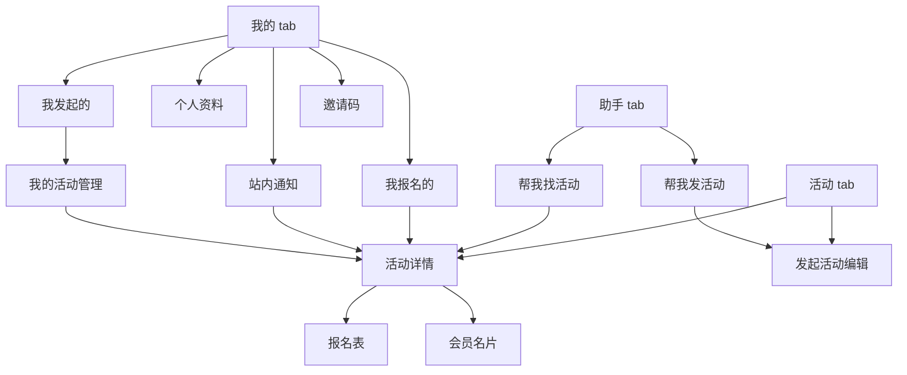

# 会聚｜小程序框架与导航

状态：导航方案 v0.2  
日期：2026-09-24  
依据：[首期 PRD](首期PRD.md)。本稿确定信息架构和跳转，不定义视觉稿或技术实现。

## 1. 导航结论

首期 tabbar 使用三个入口，顺序固定为 **活动｜助手｜我的**，默认进入“活动”。

当前客户“学加”的页面运营文案：活动页「连接资产运营人才，共建共享“学加”学友生态」；助手页「“学加”活动智能助手」。这是可配置文案，后台可修改；后台指定的“平台管理员”也可在小程序前端修改。tab 名称仍为“活动”“助手”“我的”，页面原生标题不在内容区重复。

| Tab | 首屏任务 | 主要内容 | 不放在此处的内容 |
| --- | --- | --- | --- |
| 活动 | 找到活动、查看、报名 | 活动列表、活动推荐入口、发起活动入口 | 完整报名表、活动管理页 |
| 助手 | 快速发活动或找活动 | “帮我发活动”“帮我找活动”两项任务入口 | 只有空输入框的纯聊天页 |
| 我的 | 管理个人资料和自己的活动 | 资料、我报名的、我发起的、站内通知、邀请码 | 平台管理员后台 |

活动发起可以从“活动”页直接填写，也可以从“助手”页让 AI 草拟后进入同一编辑流程。AI 不自动发布活动。

首期不设置独立“资源”tab 或会员目录页。点击活动阅读留痕、报名列表中的头像进入会员名片；名片展示字段由会员设置，并受 PRD 的资料权限约束。

## 2. 页面层级

### 一级页面：tabbar

| 页面 | 主要区块 | 关键动作 |
| --- | --- | --- |
| 活动 | 可配置运营文案；活动列表；免费/收费标识；可见的推荐活动；发起活动入口 | 打开活动详情、发起活动、切换到助手 |
| 助手 | 可配置运营文案；帮我发活动；帮我找活动 | 生成可编辑活动草稿、查看有理由的推荐活动 |
| 我的 | 资料完成状态；我的名片设置；我报名的；我发起的；站内通知；邀请码 | 维护资料、设置名片展示、管理自己活动、查看通知 |

### 二级及后续页面

| 页面 | 主要进入路径 | 主要动作或内容 |
| --- | --- | --- |
| 活动详情 | 活动列表、推荐结果、我的活动、站内通知、微信分享 | 活动信息、阅读留痕、报名列表、评论、点评、分享、报名 |
| 报名表 | 活动详情 | 本次联系手机号、自定义问题答案；提交或返回 |
| 报名结果/我的报名详情 | 报名提交后、我的报名 | 查看报名状态、截止前修改答案、活动开始前取消报名 |
| 发起活动编辑 | 活动页直接发起、助手生成草稿 | 选择免费/收费模式，填写固定金额和活动咨询联系方式，编辑活动信息与自定义报名问题、发布 |
| 前端运营文案编辑 | 仅后台指定的平台管理员可进入 | 修改活动页与助手页运营文案；普通会员不可见且无修改权限 |
| 我的活动管理 | 我的发起的活动 | 查看报名、浏览与转化数据、手动签到、取消活动 |
| 个人资料与名片设置 | 我的；受限操作的补全引导 | 绑定手机号、填写头像和用户名称、维护其余资料、逐项设置名片展示并预览 |
| 会员名片 | 点击活动阅读留痕或报名列表中的头像 | 按会员设置和访问权限展示其资料 |
| 站内通知 | 我的 | 查看已报名活动的取消、下架、恢复通知并进入活动状态页 |
| 邀请码 | 我的 | 查看自己的邀请码及邀请相关入口 |

页面名称是导航工作名，最终文案可在页面设计时调整。小程序原生导航栏承担页面标题，页面内容不重复放同名大标题。

## 3. 关键跳转

### 分享进入

微信好友、群或朋友圈分享活动 → 活动详情。分享入口带活动标识与邀请码；首次有效邀请绑定规则按 PRD 执行。活动详情作为分享落地页，用户未完善资料时也能查看活动、阅读留痕与报名列表。活动被下架时，旧分享入口展示下架状态。

### 资料补全拦截

报名、发起活动、评论、点评是受限操作。缺少绑定手机号、用户头像或用户名称时，先进入个人资料补全；完成后返回原活动或发起流程，避免丢失当前上下文。平台默认头像和用户编号名称不能通过门槛。

### 助手任务

- **帮我发活动：** 输入活动想法 → AI 草拟 → 发起活动编辑页 → 发起人检查、修改并发布。编辑页同时支持不用 AI 直接填写。
- **帮我找活动：** 展示带简短理由的活动推荐 → 活动详情 → 按现有报名规则操作。会员资料不完整时的推荐降级方式待交互设计。

## 4. 权限和状态对导航的影响

| 状态 | 导航处理 |
| --- | --- |
| 新用户只浏览 | 可打开活动详情及两类公开列表；点击头像查看完整名片与受限操作时引导补全资料 |
| 资料已完善 | 可报名、发起、评论；活动结束且已签到后可点评；可查看其他会员允许公开的资料 |
| 活动报名截止或报满 | 活动详情仍可查看，报名入口展示对应不可报名原因 |
| 活动取消或下架 | 活动详情展示状态；按 PRD 禁止对应新操作；已报名者从“我的 → 站内通知”查看变动 |
| 助手无合适推荐 | 给出继续浏览活动的入口，不用空白聊天框代替结果 |
| 我的尚无报名或发起活动 | 对应列表显示清楚的空状态和“去看活动”或“发起活动”入口 |

二级页面的主要提交按钮和底部操作需避开手机安全区域；具体位置在视觉稿中确定。

## 5. 资源与需求的可发现性

首期不增加独立资源目录。用户在活动的阅读留痕、报名列表中点击头像，可进入该会员名片，查看其选择展示的资源、需求等资料。未完善资料的浏览用户只能看到列表中的头像和名称，不能打开完整名片。

名片始终显示头像和用户名称；家乡、简介、资源、需求、真实姓名、邮箱、绑定手机号分别由会员控制是否展示，首次均默认关闭。会员可主动逐项开启，设置前可预览名片；公开范围限于已完成三项必填资料的其他会员。

**设计风险：** 资源与需求目前只有通过活动参与者列表才容易被发现。页面设计时可在列表附近提示“点击头像了解同学”，但不增加新的权限或目录功能。上线后的实际浏览路径与资料填写情况，需要用使用数据判断是否值得建立独立“资源”入口。

## 6. 本阶段验证与未定项

- 框架覆盖：3/3 个已确认 tab；活动分享进入、报名、发起、会员资料、站内通知均有路径。
- 已核对：未完善资料仍能看活动；头像和名称全平台统一；站内通知放在“我的”；管理员后台不混入小程序 tabbar。
- 待页面设计：活动列表卡片结构、助手输入与结果状态、各二级页布局、个人资料补全返回机制、名片展示设置与预览、站内通知入口样式。
- 待真机验证：微信分享及朋友圈单页模式、手机号授权、头像昵称填写、底部安全区域与实际返回路径。

本稿是信息架构方案，不代表页面已经实现或通过真机测试。

## 当前最小链路实现边界（2026-09-26）

已注册8条路由：登录兼资料补全、活动/助手/我的三个Tab、活动详情、报名表、报名详情、本人报名列表。页面入口使用真实API或明确未开放提示；不把本文完整导航设计当作已经实现。助手、发布管理、名片设置、站内通知、评论和阅读留痕不在当前实现闭环内。原生标题由pages.json统一配置；人工视觉与真实微信验收集中后置，范围和证据见根HANDOFF与资源清单。
