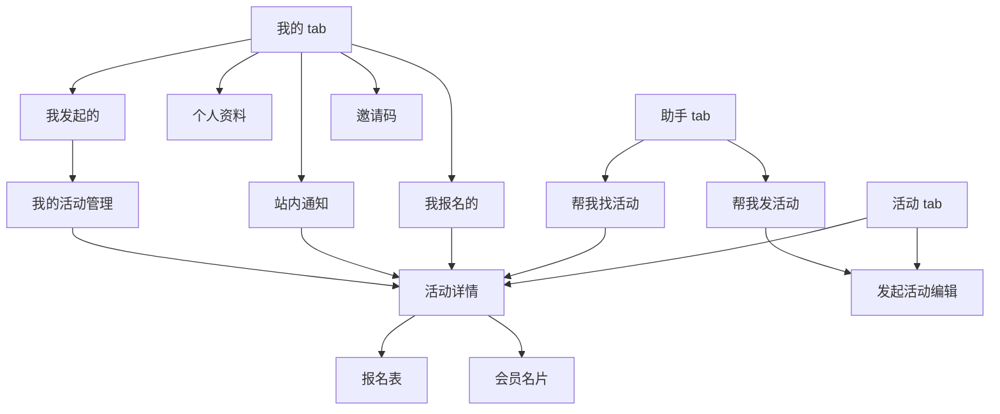

# 会聚｜小程序框架与导航

状态：导航方案 v0.2  
日期：2026-09-24  
依据：[首期 PRD](首期PRD.md)。本稿确定信息架构和跳转，不定义视觉稿或技术实现。

## 1. 导航结论

首期 tabbar 使用三个入口，顺序固定为 **活动｜助手｜我的**，默认进入“活动”。

当前客户“学加”的页面运营文案：活动页「连接资产运营人才，共建共享“学加”学友生态」；助手页「“学加”活动智能助手」。这是可配置文案，后台可修改；后台指定的“平台管理员”也可在小程序前端修改。tab 名称仍为“活动”“助手”“我的”，页面原生标题不在内容区重复。

| Tab | 首屏任务 | 主要内容 | 不放在此处的内容 |
| --- | --- | --- | --- |
| 活动 | 找到活动、查看、报名 | 活动列表、活动推荐入口、发起活动入口 | 完整报名表、活动管理页 |
| 助手 | 快速发活动或找活动 | “帮我发活动”“帮我找活动”两项任务入口 | 只有空输入框的纯聊天页 |
| 我的 | 管理个人资料和自己的活动 | 资料、我报名的、我发起的、站内通知、邀请码 | 平台管理员后台 |

活动发起可以从“活动”页直接填写，也可以从“助手”页让 AI 草拟后进入同一编辑流程。AI 不自动发布活动。

首期不设置独立“资源”tab 或会员目录页。点击活动阅读留痕、报名列表中的头像进入会员名片；名片展示字段由会员设置，并受 PRD 的资料权限约束。

## 2. 页面层级

### 一级页面：tabbar

| 页面 | 主要区块 | 关键动作 |
| --- | --- | --- |
| 活动 | 可配置运营文案；活动列表；免费/收费标识；可见的推荐活动；发起活动入口 | 打开活动详情、发起活动、切换到助手 |
| 助手 | 可配置运营文案；帮我发活动；帮我找活动 | 生成可编辑活动草稿、查看有理由的推荐活动 |
| 我的 | 资料完成状态；我的名片设置；我报名的；我发起的；站内通知；邀请码 | 维护资料、设置名片展示、管理自己活动、查看通知 |

### 二级及后续页面

| 页面 | 主要进入路径 | 主要动作或内容 |
| --- | --- | --- |
| 活动详情 | 活动列表、推荐结果、我的活动、站内通知、微信分享 | 活动信息、阅读留痕、报名列表、评论、点评、分享、报名 |
| 报名表 | 活动详情 | 本次联系手机号、自定义问题答案；提交或返回 |
| 报名结果/我的报名详情 | 报名提交后、我的报名 | 查看报名状态、截止前修改答案、活动开始前取消报名 |
| 发起活动编辑 | 活动页直接发起、助手生成草稿 | 选择免费/收费模式，填写固定金额和活动咨询联系方式，编辑活动信息与自定义报名问题、发布 |
| 前端运营文案编辑 | 仅后台指定的平台管理员可进入 | 修改活动页与助手页运营文案；普通会员不可见且无修改权限 |
| 我的活动管理 | 我的发起的活动 | 查看报名、浏览与转化数据、手动签到、取消活动 |
| 个人资料与名片设置 | 我的；受限操作的补全引导 | 绑定手机号、填写头像和用户名称、维护其余资料、逐项设置名片展示并预览 |
| 会员名片 | 点击活动阅读留痕或报名列表中的头像 | 按会员设置和访问权限展示其资料 |
| 站内通知 | 我的 | 查看已报名活动的取消、下架、恢复通知并进入活动状态页 |
| 邀请码 | 我的 | 查看自己的邀请码及邀请相关入口 |

页面名称是导航工作名，最终文案可在页面设计时调整。小程序原生导航栏承担页面标题，页面内容不重复放同名大标题。

## 3. 关键跳转

```mermaid
flowchart TD
  A[活动 tab] --> D[活动详情]
  A --> E[发起活动编辑]
  H[助手 tab] --> H1[帮我发活动]
  H[助手 tab] --> H2[帮我找活动]
  H1 --> E
  H2 --> D
  D --> R[报名表]
  D --> P[会员名片]
  M[我的 tab] --> F[个人资料]
  M --> B[我报名的]
  M --> O[我发起的]
  M --> N[站内通知]
  M --> I[邀请码]
  B --> D
  O --> G[我的活动管理]
  N --> D
  G --> D
```

### 分享进入

微信好友、群或朋友圈分享活动 → 活动详情。分享入口带活动标识与邀请码；首次有效邀请绑定规则按 PRD 执行。活动详情作为分享落地页，用户未完善资料时也能查看活动、阅读留痕与报名列表。活动被下架时，旧分享入口展示下架状态。

### 资料补全拦截

报名、发起活动、评论、点评是受限操作。缺少绑定手机号、用户头像或用户名称时，先进入个人资料补全；完成后返回原活动或发起流程，避免丢失当前上下文。平台默认头像和用户编号名称不能通过门槛。

### 助手任务

- **帮我发活动：** 输入活动想法 → AI 草拟 → 发起活动编辑页 → 发起人检查、修改并发布。编辑页同时支持不用 AI 直接填写。
- **帮我找活动：** 展示带简短理由的活动推荐 → 活动详情 → 按现有报名规则操作。会员资料不完整时的推荐降级方式待交互设计。

## 4. 权限和状态对导航的影响

| 状态 | 导航处理 |
| --- | --- |
| 新用户只浏览 | 可打开活动详情及两类公开列表；点击头像查看完整名片与受限操作时引导补全资料 |
| 资料已完善 | 可报名、发起、评论；活动结束且已签到后可点评；可查看其他会员允许公开的资料 |
| 活动报名截止或报满 | 活动详情仍可查看，报名入口展示对应不可报名原因 |
| 活动取消或下架 | 活动详情展示状态；按 PRD 禁止对应新操作；已报名者从“我的 → 站内通知”查看变动 |
| 助手无合适推荐 | 给出继续浏览活动的入口，不用空白聊天框代替结果 |
| 我的尚无报名或发起活动 | 对应列表显示清楚的空状态和“去看活动”或“发起活动”入口 |

二级页面的主要提交按钮和底部操作需避开手机安全区域；具体位置在视觉稿中确定。

## 5. 资源与需求的可发现性

首期不增加独立资源目录。用户在活动的阅读留痕、报名列表中点击头像，可进入该会员名片，查看其选择展示的资源、需求等资料。未完善资料的浏览用户只能看到列表中的头像和名称，不能打开完整名片。

名片始终显示头像和用户名称；家乡、简介、资源、需求、真实姓名、邮箱、绑定手机号分别由会员控制是否展示，首次均默认关闭。会员可主动逐项开启，设置前可预览名片；公开范围限于已完成三项必填资料的其他会员。

**设计风险：** 资源与需求目前只有通过活动参与者列表才容易被发现。页面设计时可在列表附近提示“点击头像了解同学”，但不增加新的权限或目录功能。上线后的实际浏览路径与资料填写情况，需要用使用数据判断是否值得建立独立“资源”入口。

## 6. 本阶段验证与未定项

- 框架覆盖：3/3 个已确认 tab；活动分享进入、报名、发起、会员资料、站内通知均有路径。
- 已核对：未完善资料仍能看活动；头像和名称全平台统一；站内通知放在“我的”；管理员后台不混入小程序 tabbar。
- 待页面设计：活动列表卡片结构、助手输入与结果状态、各二级页布局、个人资料补全返回机制、名片展示设置与预览、站内通知入口样式。
- 待真机验证：微信分享及朋友圈单页模式、手机号授权、头像昵称填写、底部安全区域与实际返回路径。

本稿是信息架构方案，不代表页面已经实现或通过真机测试。

2026-09-27开发映射：活动页“发起活动”进入`pages/activity/editor`；我的“我发起的”进入`pages/activity/organized`，列表进入`pages/activity/manage`查看私密报名名单、编辑/发布/取消；我的“站内通知”进入`pages/notification/index`，通知链接返回活动详情。编辑页资料补全返回时保留活动ID与本人表单。此轮覆盖人工发起、管理和活动变动通知，AI草拟、签到、浏览统计和管理员处置仍另行实现。证据层级见实现日志，不将路由存在等同真机验收。

## 当前最小链路实现边界（2026-09-26）

已注册8条路由：登录兼资料补全、活动/助手/我的三个Tab、活动详情、报名表、报名详情、本人报名列表。页面入口使用真实API或明确未开放提示；不把本文完整导航设计当作已经实现。助手、发布管理、名片设置、站内通知、评论和阅读留痕不在当前实现闭环内。原生标题由pages.json统一配置；人工视觉与真实微信验收集中后置，范围和证据见根HANDOFF与资源清单。

2026-09-27基本信息页视觉映射：`pages/activity/editor`内第一步按《会聚-发起活动页-高保真.png》排列九块信息卡片；下一步显示既有报名问题编辑，返回保留表单。导航标题统一为“发起活动”。本轮用户确认仅布局复刻，封面上传/富文本/地图选点标明未开放，报名设置与确认发布两张设计稿的精细复刻后续进行。封面、人数、截止时间仍按PRD选填。

2026-09-27第二步接续：报名设置页已按第二张设计稿调整卡片及列表，人数、截止时间与第一步共享数据，自定义问题支持弹层编辑和排序。报名须知暂未开放，需要报名保持开启。

2026-09-27第三步接续：确认发布页展示活动预览、介绍、报名设置及其他信息，使用当前表单及会员数据，可返回对应步骤编辑。勾选核对信息后才能进入既有发布确认弹窗；没有正式发布规范文档时不虚构协议，入口为费用与发布说明。三步按微信开发者工具实际显示调整 rpx 字号、输入框和安全区，人数及截止设置改为上下布局保障可读性。后续小程序 UI 统一在微信开发者工具验收。

2026-09-27封面能力更新：用户确认使用后端本机存储后，基本信息页已支持选择PNG/JPG、上传、更换及点击预览，确认页读取当前未保存封面，保存后通过真实活动接口回显。封面仍选填，图片上限2 MiB；上传失败保留旧封面，取消选图不提示错误。富文本与地图选点仍未开放。

2026-09-27活动详情视觉映射：按《会聚-活动详情页-高保真.png》调整封面、概要、介绍、报名信息、头像名单和底栏，名单首行最多8人，可展开接口返回名单。阅读留痕随后接入独立接口（本地迁移与微信工具模拟身份验收已完成），评论仍未开放；不显示设计稿虚构的计数、评价或多图页码。原生导航和报名/咨询权限继续沿用。

2026-09-27扫码入口：活动页搜索框右侧“扫码”调用微信scanCode，识别后进入既有活动详情。当前接受`/pages/activity/detail?id=<UUID>&inviteCode=<可选邀请码>`（也可省略开头斜杠）以及`huiju://activity/<UUID>?inviteCode=<可选邀请码>`普通二维码内容；只传入校验后的id/inviteCode，不允许其他路由、重复参数或任意网页跳转。取消无提示，识别失败/不支持码弹窗说明。活动不存在和下架沿用详情真实API与状态，已报名者显示查看我的报名。没有正式AppID前不生成微信小程序码、不接任意HTTPS链接/scene短码；普通测试码仅供小程序内部扫码，不代表微信外部扫一扫可直接打开小程序。

2026-09-27阅读留痕映射：详情页独立显示阅读会员头像/名称，首行8人，可展开与分页；浏览次数、人数及转化率只在发起人管理页显示。阅读失败独立重试，不阻断活动内容与报名。会员名片仍未实现，本轮不扩展该入口。代码与 L1 已完成；0003 已授权在本机开发库执行，阅读名单及统计已在微信工具以模拟身份/真实本地数据验收，真实微信及真机仍未验收。

2026-09-27补充页面：我的“我的邀请码”进入`pages/invitation/index`，读取本人当前邀请码并支持复制，活动入口使用switchTab返回活动页；未增加邀请人列表、二维码或返利。站内通知按新增设计稿调整，继续使用既有通知接口和标读/活动跳转。个人资料、名片设置、会员名片新增设计稿已保存，页面与字段权限后端仍待实现，不等同已开放。

2026-09-27个人资料与名片：我的→个人资料（`pages/member/profile`）编辑头像、名称及六项选填资料；绑定手机号仍通过既有登录与完善资料页。我的/资料页→名片展示设置（`pages/member/card-settings`），七开关默认关闭，保存前在当前页弹层预览。活动详情的发起人、报名名单、阅读名单头像→会员名片（`pages/member/card?id=会员UUID`），完整度不足引导补全；直接打开同样受API门槛限制。首页仍为活动Tab。新页面L1与数据库验证见实现日志，微信/真机验收单独记录。

2026-09-28我的活动与报名详情：保留我发起/我报名两条已存在路由，统一原生标题“我的活动”，顶部切换用replace避免层层堆栈。列表按活动开始/结束时间筛选，取消/下架优先，发起列表另含草稿；卡片使用真实封面、报名/容量/费用，不显示无接口的浏览量，不开放取消后重新发布。报名详情按原稿重排概要、状态、动态答案、咨询与操作说明，咨询自由文本只提供复制。隐藏、换号、卸载清除私密资料；取消确认在原身份和页面代次仍有效时才发送。
